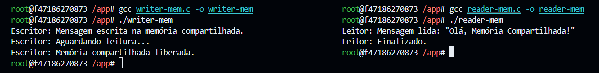
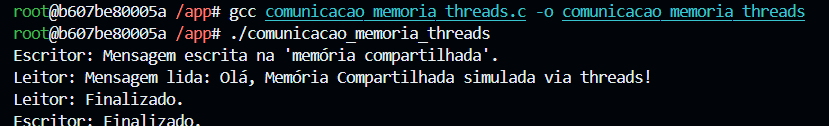

# Prática de comunicação de tarefas

**Aluno:** [Lucas Tales B. Barbosa](https://github.com/Lucas-Tales1)  
**Data:** 02/06/2025  

## Introdução

Esta atividade tem como objetivo a prática de comunicação entre tarefas em sistemas operacionais, explorando tanto processos quanto threads. Foram utilizados dois métodos principais de comunicação: via **arquivos** e via **memória compartilhada**. A atividade envolveu a criação de programas com processos separados e posteriormente a reimplementação com o uso de threads, visando comparar a complexidade e desempenho entre as abordagens.

## Relato

Inicialmente, foram implementados dois pares de programas em C:

### 1. Comunicação via Arquivos

- Um processo escritor cria e escreve uma mensagem em um arquivo.
- Um processo leitor lê o arquivo e sinaliza a leitura renomeando o arquivo.
- A sincronização é feita por meio da verificação da existência do arquivo original.

#### Compilação dos programas `writer-file.c` e `reader-file.c`:

#### Execução dos programas `writer-file` e `reader-file`:

---

### 2. Comunicação via Memória Compartilhada

- O escritor cria um segmento de memória compartilhada e escreve uma mensagem.
- O leitor acessa o mesmo segmento, lê a mensagem e sinaliza modificando o primeiro byte da memória.
- A sincronização se dá por meio da leitura/modificação direta da memória.

#### Compilação e execução dos programas `writer-mem.c` e `reader-mem.c`:

---

### 3. Comunicação com Threads

Na sequência, os programas foram reimplementados usando **threads** no lugar de processos. Como as threads compartilham o mesmo espaço de memória do processo principal, não foi necessário utilizar arquivos ou memória compartilhada do kernel. Em vez disso, utilizou-se uma **variável global compartilhada** entre as threads e **mecanismos de sincronização como `pthread_mutex` e `pthread_cond_t`** para controlar o acesso e a comunicação entre escritor e leitor.

#### Compilação e execução do programa com threads `comunicacao_arquivos_threads.c`:

---

## Comparação

### 1. Complexidade

| Critério               | Processos (comunicação por arquivo/memória) | Threads (comunicação por variáveis e mutex) |
|------------------------|---------------------------------------------|---------------------------------------------|
| Comunicação            | Exige recursos do SO (arquivo ou memória IPC) | Simples compartilhamento de variáveis        |
| Sincronização          | Por existência de arquivo ou valor na memória | Via mutex e variáveis de condição            |
| Gerenciamento           | Processos independentes, mais pesados         | Mais leve, com menor overhead                 |
| Implementação          | Separação clara, mas exige cuidado com IPC   | Requer cuidado com condições de corrida      |

### 2. Tempo de execução

De forma geral, os programas com **threads executam mais rapidamente**, pois:

- Evitam chamadas de sistema para criar processos ou acessar arquivos.
- Compartilham o mesmo espaço de memória, eliminando a necessidade de mecanismos IPC do kernel.
- Possuem menor overhead na criação e troca de contexto.

## Conclusão

A atividade permitiu compreender na prática as diferenças entre comunicação por processos e por threads, tanto em termos de implementação quanto de desempenho. Enquanto a comunicação entre processos exige mecanismos mais robustos e externos (como arquivos e memória compartilhada), as threads proporcionam uma comunicação mais direta e eficiente, embora exijam maior cuidado com sincronização para evitar condições de corrida.

